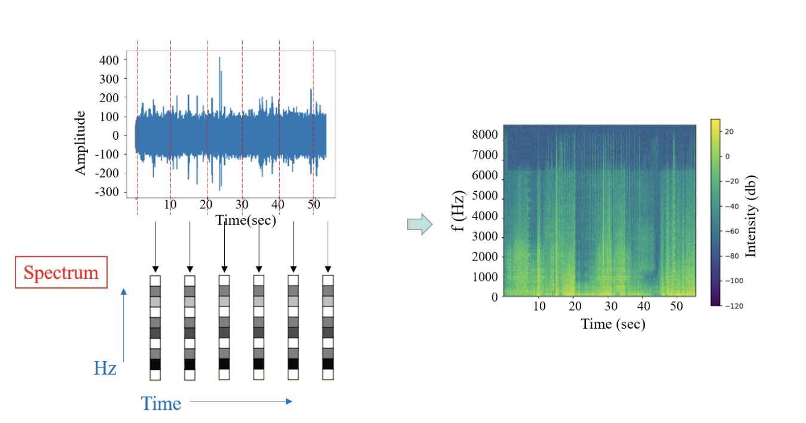

# 蜜蜂音頻系統架構
1. **整體架構**

透過安裝於蜂巢內部的聲音感測機構每60秒鐘讀取音頻資料，擷取音頻特徵後，使用機器學習模型，作出即時評判蜜蜂目前是否處於失王狀態。
2. **硬體器材**
   1. 設備器材一覽表
      類別|品項|數量|品牌/特殊要求|
      |---|---|---|---|
      |聲音感測機構|樹莓派|5|Raspberry pi 3b+|
      |||SD card|5|Samsung microSDHC UHS-I Class10 32GB|
      |||麥克風|5|IK Multimedia iRig Mic Lav|
      |||音效卡|5|USB外接式音效卡(無特別款式要求)|
      |||外接硬碟|5|TOSHIBA Canvio Advance V9 1TB 2.5吋行動硬碟|
      |||麥克風轉接口|5|3.5mm 的三環四節轉二環三節轉接口|
      |||Y型硬碟電源訊號線|5|USB3.0 轉 Micro B|
      |||樹莓派電源線|5|microUSB 轉 USB2.0 2A 電流線|
      |||USB插座|5|雙孔插座，一孔須提供2A電流|
      |||ABS塑膠外殼|5|180mm x 110mm x 60mm|
      |||矽利康|少許|作為塑膠外殼鑽洞的封口使用|
      |||絕緣膠帶|少許|作為塑膠外殼上下蓋封口使用|
      |WIFI通訊|AP路由器|1|【D-Link】DIR-819|
      |實驗蜂箱|失王蜂箱|4|內含八片蜂巢片|
      ||正常蜂箱|1|內含八片蜂巢片|||
   2. 硬體介紹
      1. 樹莓派3b+：作用有三：
         1. 錄製蜜蜂音訊，轉換為MFCC後，使用WIFI信號上傳至資料庫
         2. 下載訓練好的機器學習模型，並使用轉換好的MFCC作為模型輸入，判斷蜂巢內部狀況
         3. 上傳機器學習判斷結果於資料庫中
      2. SD card ：作為樹莓派主要的運算空間，使用raspbian作為作業系統，記憶卡型號為【Samsung】 microSDHC UHS-I Class10 32GB 
      3. 使用iRig Mic Lav，搭配3.5mm 的三環四節轉二環三節轉接口，以支援音效卡。
      4.  外接硬碟（HDD）：用於在本地端備份音檔，使用Y字形傳輸線，一端連接樹莓派，一端連結電源孔，以確保供電穩定，使用型號為【TOSHIBA 東芝】先進碟Canvio Advance V9 1TB 2.5吋行動硬碟。
      5. ABS塑膠萬用盒：以180mm x 110mm x 60mm的塑膠萬用盒作為硬體設備外盒容器，鑽出麥克風與電源線兩個開口，穿過線後使用矽利康封住開口，並在萬用盒的盒蓋連接處使用絕緣膠帶密封。
   3. 硬體設置： 見[樹莓派設定](./bee_sound_hardware/README.md "Title") 。
3.  **音頻轉換**
透過將錄製到的音頻檔案使用短時距傅立葉變換與梅爾倒頻譜分析後，可獲得代表此段音檔的特徵訊號，進而使用機器學習模型作為分析使用，其中所使用到的概念如下。
       1. 傅立葉變換:將複雜的聲紋轉換為不同頻率的餘弦訊號疊加，其中離散訊號的傅立葉轉換公式如下：
      $  Xk=∑_{n=0}^{N+1}x_ne^{-i2\pi kn/N}$
	     其中$x_0$,$x_1$...$x_{n+1}$為虛數，$e^{i2 \pi /N}$為1的第Ｎ個根。
       2. 倒頻譜（cepstrum)：通常是為了後續計算方便，將訊號先透過傅立葉轉換後，取其絕對值，再取其對數值，最後經過反傅立葉轉換獲得的，類似於以分貝為振幅（amptitude)單位的訊號。其中原本在頻譜圖上的獨立變數為頻率，轉到倒頻譜圖中的獨立變數為倒頻率（quefrency)，為一時間的度量單位。
       3. 頻譜圖(spectrogram)轉換：將獲得音檔以時序切割單元，並將其單位轉換為分貝後，透過傅立葉轉換獲得頻率-振幅的頻譜信號圖後，再將其轉為可視化的圖形過程。將頻譜圖懸轉90度後，以頻率為軸切割單元，將振幅的數字轉換為色階，再將色階圖以時序排列，即可獲的可視化頻譜圖。
      
       4.運作方法見：見[特徵轉換](./lstm/Feature_extraction/Feature_extraction.ipynb) 與[特徵可視化](./lstm/visualization/spectrum_visualization.ipynb)。
4.  **LSTM**
       1. 音頻訓練流程
         在提取完成音頻的梅爾特徵值後，會透過深度模型進行訓練，此訓練的架構如圖1 所示，該訓練模型為假設音頻變化的過程變化有關聯性的影響，故透過時序性的輸入訓練參數$x_t$（梅爾特徵值），可透過不同時間段輸入的參數值（$x_{t-1}$,$x_{t+1}$等），獲得參數間的關聯性，並於最後輸出可代表模型預測結果的數值$h_t$，此數值最後可透過線性回歸模型進行解碼預測，獲得輸出結果$y_t$，此即為預測結果。
         
       2. LSTM訓練架構
         在模型進行輸入時，LSTM模型會透過時間序列的方式進行參數x_t的輸入，而上段時間的訓練結果，於圖中被稱為$h_{t-1}$，此輸出必須與接下來的輸入$x_t$經過三道門的交互訓練過程，才能變成長期可依賴的資訊內容$r_t$，並將其輸入至下一個訓練階段。此訓練的三道門分別為：遺忘門（Forget gate），輸入門（Input gate），與輸出門（Output gate）。

      
       3. 訓練方法：見[LSTM訓練](./lstm/training/lstm_training.ipynb "Title")

